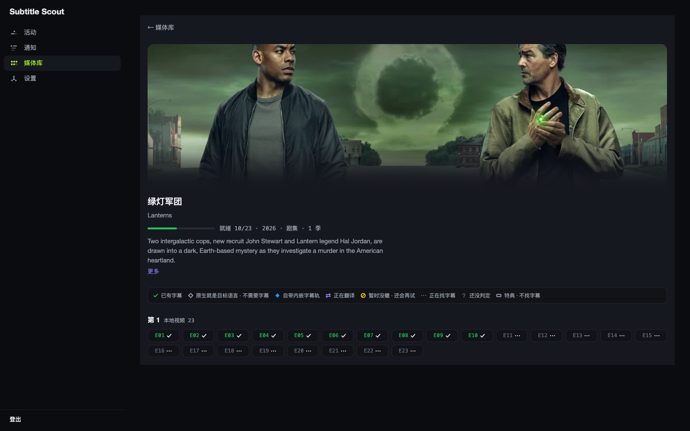

# subtitle-scout

[English](#quick-start-5-minutes) · [中文](#快速上手)

**Website**: https://subtitlescout.com · **Live demo**: https://demo.subtitlescout.com （只读演示站 / read-only demo）

subtitle-scout watches a media library, finds a matching Chinese subtitle, verifies it, and writes it next to the video. It scans filesystem roots; it does not depend on Jellyfin, Emby, or Plex.

**What it does:** discover titles missing Chinese sidecars → search and rank candidates → install; season packs; optional directory repair against TMDB (reversible); a dashboard with an activity log.

subtitle-scout 盯着媒体库，自动找到、验证并放好最合适的中文字幕。直接扫描媒体根目录，不依赖任何媒体服务器。字幕落盘后由播放器自行刷新。

---


## Quick Start (5 Minutes)

Get subtitle-scout running from zero to dashboard in under 5 minutes.

### Prerequisites

- **Docker** and **Docker Compose** installed
- A media library directory (NAS, local disk, or any folder with video files)
- Internet connection for API access

### Step 1: Get API Keys

Two credentials are required: **TMDB** (recognizes every file) and an **LLM** key set (judging and translation). The wizard is only complete once both are in place. Every subtitle source is optional.

Of the seven sources, five take keys and the wizard can skip them all — configure the ones for your language anyway (the wizard and Settings only show sources relevant to your target language). OpenSubtitles and **SubDL** are international catalogs useful for **every target language** — don't skip them. ASSRT is the professional Chinese catalog (finished Chinese sidecars); **r3sub** carries official Traditional Chinese tracks from Taiwan releases (email + password of your r3sub.com account). Jimaku feeds the translation agent with Japanese source subtitles. The remaining two, **SubHD** and **Zimuku**, need no keys — they are Chinese-focused sources you enable with a toggle in Settings (off by default; see [SECURITY.md](./SECURITY.md) for the terms-of-service caveat).

LLM (OpenAI-compatible) is a separate wizard step and is not covered here. One expectation to set now: **model tier matters more than any other setting.** The agent does long multi-step tool-calling; models below roughly the `deepseek-v4-flash` / mini tier do not fail loudly — they confidently fabricate, which shows up as misidentified media rather than an error. If matching quality is poor, suspect the model tier before filing a bug. Good value starting points: `deepseek-v4-flash` (api.deepseek.com), Qwen `qwen3.5-plus` (Alibaba DashScope), or any current mini/flash-class frontier model. Check current prices on each provider's official pricing page.

**Credentials**: [English](docs/GET_CREDENTIALS.en.md) · [中文](docs/GET_CREDENTIALS.md)

#### Required: TMDB API Key (Free)

TMDB powers media file recognition. Without it, subtitle-scout cannot identify your files.

1. Sign up at [themoviedb.org](https://www.themoviedb.org)
2. Go to **Settings** (top-right avatar menu) → **API**
3. Request a **Developer** key
4. Copy the API key (v3 32-char key or v4 Read Access Token both work)

**→ [TMDB](docs/GET_CREDENTIALS.en.md#1-tmdb-api-key)** · [中文](docs/GET_CREDENTIALS.md#1-tmdb-api-key)

#### Strongly recommended: ASSRT Token (Free)

ASSRT is the primary Chinese subtitle source. The wizard lets you skip it; don't, if you want Chinese subs.

1. Register at [assrt.net](https://assrt.net/user/register.xml) (the homepage does not show Sign up)
2. Log in, then open [https://assrt.net/usercp.php](https://assrt.net/usercp.php) (nav: **用户面板**)
3. Copy the API token

**→ [ASSRT](docs/GET_CREDENTIALS.en.md#2-assrt-token)** · [中文](docs/GET_CREDENTIALS.md#2-assrt-token)

#### OpenSubtitles and Jimaku (configure anyway)

OpenSubtitles is an international source for Chinese-speaking and non-Chinese-speaking users alike. Jimaku is not a professional Chinese catalog; it supplies Japanese **source** subtitles to the translation agent.

- OpenSubtitles: [https://www.opensubtitles.com/en/consumers](https://www.opensubtitles.com/en/consumers) → **API consumers** → **NEW CONSUMER**. No VIP. Name: letters and digits only.
- Jimaku (Japanese): [https://jimaku.cc/account](https://jimaku.cc/account)

**→ [OpenSubtitles](docs/GET_CREDENTIALS.en.md#3-opensubtitles-api)** · [Jimaku](docs/GET_CREDENTIALS.en.md#4-jimaku-api-key)

### Step 2: Clone and Configure

```bash
# Clone the repository
git clone https://github.com/fancydirty/subtitle-scout.git
cd subtitle-scout

# Create the cache directory (holds the SQLite DB and logs).
# Needed up front on Synology/DSM: its Docker daemon does not auto-create
# bind-mount host paths the way standard Linux Docker does.
mkdir -p cache

# Create environment file
cp .env.example .env
```

**Edit `.env`** — you only need to set the timezone:

```bash
TZ=Asia/Shanghai  # or your timezone
```

> **Important**: API keys are **NOT** configured in `.env`. You'll enter them through the web dashboard in Step 4.

### Step 3: Start the Container

```bash
docker compose up -d
```

Wait 10-20 seconds for the container to initialize.

If `ghcr.io` is slow or blocked on your network, pull through a mirror and retag — it serves the same image digest:

```bash
docker pull ghcr.1ms.run/fancydirty/subtitle-scout:latest
docker tag ghcr.1ms.run/fancydirty/subtitle-scout:latest ghcr.io/fancydirty/subtitle-scout:latest
```

### Step 4: Complete Setup Wizard

1. Open **`http://localhost:8099`** (or `http://<your-server-ip>:8099` if running on a NAS/server)

2. **Create Admin Account** — the setup wizard will prompt you to:
   - Set a username and password (minimum 10 characters)
   - This generates an API key for automation (shown once)

3. **Configure Credentials** — in the Settings page, fill in:
   - **TMDB** card: paste your TMDB API key
   - **ASSRT** card: paste your ASSRT token
   - **LLM** card: enter Base URL, API Key, and Model name (all three from the same provider)

4. **Add Media Directories**:
   - Go to **Settings** → **Media**
   - Click **Browse** and navigate to your media folder
   - The default Docker setup mounts your host root at `/hostroot`, so:
     - Host path `/mnt/media/Movies` → select `/hostroot/mnt/media/Movies`
     - Host path `/Users/yourname/Media` → select `/hostroot/Users/yourname/Media`
   - Click **Add** to save

> **Same-filesystem rule for the archive dir**: when subtitle-scout reorganizes a media
> folder (realign), it moves it with atomic `rename` and deliberately never falls back to
> copying — no half-moved libraries. If the archive directory (`REALIGN_ARCHIVE_ROOT`,
> default: parent of the library root) is on a different filesystem, the move is skipped
> (`abandon`) and logged. Synology note: every *shared folder* is its own btrfs subvolume,
> so cross-shared-folder moves always fail with `EXDEV` — keep the archive dir inside the
> same shared folder as the library it serves.

### Step 5: Verify Setup

Run the health check:

```bash
docker compose exec subtitle-scout node dist/cli/index.js doctor
```

You should see green checkmarks (✓) for:
- TMDB API key valid
- ASSRT token valid
- LLM endpoint working (if configured)
- Media roots writable
- Database ready

### Step 6: Start Watching

Subtitle-scout automatically scans your media library every 15 minutes. To trigger an immediate scan:

1. Go to the **Library** tab in the dashboard
2. Click **Full Library Reconcile** (or wait for the next auto-scan)
3. Watch the **Activity** page for real-time progress

That's it. Subtitle-scout is now monitoring your library and will fetch subtitles for any media missing them, in whichever target language you set (Chinese by default — see [Target languages](#目标语言支持分层) for what each language actually gets).

### What's Next?

- **Activity Page** (`http://localhost:8099/activity`) — see what's being processed in real-time
- **Notifications** — review download history
- **Advanced Settings** — configure optional sources (OpenSubtitles, hardsub detection, etc.)

For detailed configuration, troubleshooting, and development setup, see the sections below.

---

## 快速上手



凭证说明（中文 / English）：[docs/GET_CREDENTIALS.md](docs/GET_CREDENTIALS.md) · [docs/GET_CREDENTIALS.en.md](docs/GET_CREDENTIALS.en.md)。ASSRT 是专业中文源；r3sub 收录台版官方繁中字幕轨（填 r3sub.com 账号邮箱+密码）；OpenSubtitles 与 SubDL 是国际源、任何目标语言都有用，不要省；Jimaku 给翻译 agent 当日文源字幕。向导和设置页只展示与你目标语言相关的源。

启动后通过监控页完成配置：

```bash
mkdir -p cache   # 群晖/DSM 必须先建：其 Docker 不像标准 Linux 那样自动创建 bind 挂载的宿主目录
cp .env.example .env
docker compose up -d
```

若 `ghcr.io` 拉取缓慢或被墙，可走镜像源再改标签，digest 与上游一致：

```bash
docker pull ghcr.1ms.run/fancydirty/subtitle-scout:latest
docker tag ghcr.1ms.run/fancydirty/subtitle-scout:latest ghcr.io/fancydirty/subtitle-scout:latest
```

然后按这个顺序操作：

1. 打开 `http://<主机IP>:8099`，完成管理员向导
2. 在 Settings 中配置 TMDB、LLM、字幕源和媒体目录
3. 运行 `doctor`，确认各项接线状态
4. 等待首轮扫描完成

**关于媒体目录**：默认 compose 把宿主机根目录挂到 `/hostroot`，目录选择器因此可以访问任意宿主机路径。这个挂载权限较高，只适合你信任所有能访问监控页的用户的环境。更严格的部署可以修改 compose，只挂载媒体目录，例如 `./media:/media`，然后把 `MEDIA_ROOTS` 设为 `/media`；此时不要在设置页选择 `/hostroot` 路径。

> **归档目录同盘规则**：整理（realign）用原子 `rename` 搬媒体目录，绝不退化为拷贝——宁可不搬，
> 不留半成品库。归档目录（`REALIGN_ARCHIVE_ROOT`，默认库根上一级）与媒体库不在同一文件系统时
> 会跳过搬移（abandon）并留日志。群晖注意：每个**共享文件夹**是独立 btrfs 子卷，跨共享文件夹
> 的搬移必然 `EXDEV`——归档目录请放在它服务的库的同一共享文件夹内。

想同时跑一个 Jellyfin 当播放器（和 scout 的字幕功能完全无关，纯粹图省事）？见 `docker-compose.bundle.yml`。

---

## 配置凭据

必填两类：TMDB（识别文件，硬性必填）与大模型三件套（`LLM_BASE_URL` / `LLM_API_KEY` / `LLM_MODEL`，甄别与翻译都要用）——这两项齐了向导才算完成。字幕源全部可选，但建议配置 ASSRT（专业中文字幕源，免费）与 OpenSubtitles，日文源用 Jimaku；SubHD 与 Zimuku 免密钥，在设置页开关即可启用。

**全部在首次设置向导里填写**：容器起来后打开 `http://<主机>:8099`，向导会逐项引导；之后随时可在设置页修改。凭据落库存储在你自己的部署里——**`.env` 里塞凭证不生效**（daemon 只读数据库，2026-08-20 起这是唯一入口）。

### 1. ASSRT Token

**获取步骤**：
1. 注册 [assrt.net](https://assrt.net/user/register.xml)
2. 登录后点「用户面板」，或直接打开 [https://assrt.net/usercp.php](https://assrt.net/usercp.php)
3. 复制 API token，在设置向导（或设置页）的 ASSRT 卡片里粘贴

**预期管理**：
- **配额约 5 次/分钟**，程序已自动限速，无需操心
- **ASSRT 对欧美剧集覆盖有限**："暂时没找到合适的字幕"是正常结果，不是故障

### 2. 大模型 API Key

**任意 OpenAI-compatible 端点均可**（DeepSeek、OpenAI、硅基流动等）。在设置向导的 LLM 卡片里填三件套：

| 字段 | 说明 |
|------|------|
| Base URL | 如 `https://api.deepseek.com/v1` |
| API Key | 对应端点的 API key |
| 模型 | 模型名，如 `deepseek-v4-flash` |

**关键**：三项必须来自**同一个服务商**。模型能力影响匹配质量。

#### 模型选择（预期管理，建议先读）

- **推荐起步档**：`deepseek-v4-flash`（api.deepseek.com，当前性价比基准）；同档或更强均可。阿里 `qwen3.5-plus`（DashScope）、Kimi、GLM、MiniMax 的现役主力档也都够格——这五家大陆网络直连可用。OpenAI / Gemini / Claude 的官方 API 在大陆被封锁，需自备网络环境。
- **底线警告**：agent 的识别与匹配是长链路多步工具调用。**太弱的模型（本地 3B 级、nano 级）不会显式报错，而是自信地编造**——表现为"识别成了另一部片"而不是失败提示。识别质量差时，先怀疑模型档位，再考虑报 bug。`doctor` 命令的 LLM 检查行会报出当前接的模型名。
- 价格随时在变，本文不贴数字——以各服务商官方定价页为准。

### 3. TMDB API Key（硬性必填）

subtitle-scout 直接扫描媒体根目录发现文件，靠 TMDB 识别标题/年份/季集排布——**没有这把钥匙，`watch`/`reconcile-all` 会直接报错退出**，不会悄悄跑一个"什么都识别不了"的空转进程。

**它还顺手解决一个召回率问题**：字幕库按标题的**具体变体**分区索引，而同一部片的中文译名往往有好几个变体。以生产实例《爱，死亡和机器人》为例，它在各处的官方/民间译名分裂成：

- 「爱，死亡和机器人」（官方译名，用「和」）
- 「爱死亡与机器人」（用「与」）
- 「爱、死亡 & 机器人」（用顿号 + &）

「和」≠「与」，字幕站把它们分在不同的搜索分区里。只拿到一个变体，就只搜得到那一个分区的字幕；拿到**全部变体**，召回率立刻上一个台阶。TMDB 的 `/alternative_titles` 接口正好躺着一部片在 CN/TW/HK 区的全部译名变体。

**怎么申请**（免费）：

1. 注册 / 登录 [themoviedb.org](https://www.themoviedb.org)
2. 右上角头像 → **设置（Settings）**
3. 左侧 **API** → 申请一个 **Developer** key
4. 复制 key（v3 的 32 位 key 或 v4 的 Read Access Token 都支持，程序自动识别认证方式）

**填哪**：设置向导（或设置页）的 TMDB 卡片。填完即生效（向导落库同进程点火，不用重启容器）。

### OpenSubtitles / Jimaku

OpenSubtitles 是面向**中文用户和海外用户**的国际源，不是「只给翻译用」才值得配。专业中文站覆盖不到的片目可以在这里找到；非中文用户也把它当作常用源。向导允许跳过，**仍应配置**。

Jimaku **不是**专业中文站：它给翻译 agent 提供日文源字幕。

**怎么申请**（免费，不必买 VIP）：

1. 注册 [opensubtitles.com](https://www.opensubtitles.com) 账号
2. 打开 [https://www.opensubtitles.com/en/consumers](https://www.opensubtitles.com/en/consumers)（侧栏 **API consumers**）
3. 点 **NEW CONSUMER**，名字仅限字母数字（如 `subtitlescout`）
4. 复制生成的 key，在设置页的 OpenSubtitles 卡片里粘贴

Jimaku（日文源字幕）：登录 [https://jimaku.cc/account](https://jimaku.cc/account) 生成 key，写入 Settings 的 Jimaku 卡片。

**可选加成**：额外填 `OPENSUBTITLES_USERNAME` / `OPENSUBTITLES_PASSWORD`——登录后免费档约 20 次下载/天；不填则走匿名档。创建 consumer 时勾选 "Under development" 可提高开发期额度。

搜索本身不耗下载配额。doctor 探测不会扣下载次数。向导允许不配 OpenSubtitles；不配则中外用户都会少一个覆盖面最广的国际源。

---

## 起完先体检：doctor

启动后**先跑一遍 doctor**，确认接线正确：

```bash
docker compose exec subtitle-scout node dist/cli/index.js doctor
```

**⚠️ 容器没跑起来时**（exec 会报 "container is not running"——比如启动期体检想看接线）：

```bash
docker compose run --rm --no-deps subtitle-scout node dist/cli/index.js doctor
```

**示例输出**：

```
✓ tmdb  TMDB API key 有效
✓ assrt  ASSRT token 有效，当前配额余量 180
⊘ opensubtitles  未配置(可选 provider)——在 dashboard 设置页配置 OPENSUBTITLES_API_KEY 启用
⊘ zimuku  未配置(可选 provider,灰色站点条款风险自担)——设置页开启 zimuku 开关启用
✓ llm  LLM 端点可用，最小对话成功
✓ media-roots  2 个媒体根目录全部可写
✓ mount-capabilities  挂载能力画像 — /hostroot/mnt/media/Movies（硬链接: 支持, 大小写敏感: 是, 可写: 是）...
✓ database  数据库可用，schema 版本 <N>
✓ stuck-jobs  无卡住任务

接线检查通过，可以起 watch 了。
```

如果某项显示 `✗`，按提示修复后重跑。`⊘` 是跳过（可选项未配置），不算失败。

---

## 监控页

访问 `http://<主机IP>:8099`（端口可通过 `DASHBOARD_PORT` 自定义）：

- 每部剧/电影的字幕覆盖状态一览（哪几集缺、哪几集处理中、哪几集暂时没找到）
- 活动页：正在处理 / 已排队的作品实时状态（SSE 推送）+ **决策历史**——每次处理的一行人话摘要（选了谁、为什么没找到），点击展开该次运行的工具调用 trace（搜索→下载→验证→安装的完整决策链）
- 通知页：持久化的"找到了什么"流水

### 账号鉴权（单管理员）

首次访问监控页会进入**创建管理员向导**（用户名 + 密码，密码至少 10 位）。设置后：

**⚠️ 安全提示**：首次启动后请**立即**完成管理员向导！未初始化状态下，`/api/v2/auth/setup` 端点对局域网完全开放——**局域网内任何人都能抢先创建管理员账号**接管你的实例。如果需要在不可信网络环境暴露，请先：
- 配置 `DASHBOARD_TOKEN`（老部署兼容方案）
- 或改 docker-compose.yml 的 ports 为 `127.0.0.1:${DASHBOARD_PORT:-8099}:...` 再用反向代理加鉴权

- 用**账号密码登录**，会话以 httpOnly cookie 保持（30 天滚动过期）。
- 同时生成一个 **API key**（32 位十六进制，向导页一次性完整显示，之后在「设置 → 安全」里以脱敏尾 4 位展示，可复制或重新生成）。脚本/集成用 API key 调接口：

  ```bash
  curl -H 'X-Api-Key: <你的-api-key>' http://<主机IP>:8099/api/v2/library
  # 或（SSE/EventSource 无法带头时用 query）
  curl 'http://<主机IP>:8099/api/v2/library?apikey=<你的-api-key>'
  ```

- **忘记密码**：没有邮件找回（自托管形态），在服务器上运行 `docker compose exec subtitle-scout node dist/cli/index.js auth reset` 清除管理员凭据，下次访问重新进入创建向导。

**旧 `DASHBOARD_TOKEN` 兼容**：已设该变量的老部署继续有效——它等价于一个 API key（`?token=<值>` 或 `X-Dashboard-Token` 头仍被接受）。建议在向导里建好账号后**移除** `DASHBOARD_TOKEN`，改用账号密码。

**无内建 HTTPS**：监控页面向家庭局域网，自身不做 TLS。如需从公网访问，请在前面加一层反向代理终止 TLS，例如 Caddy：

```
scout.example.com {
    reverse_proxy 127.0.0.1:8099
}
```

（Caddy 自动申请证书；nginx/Traefik 同理，把 `:8099` 反代出去即可。）

---

## 它怎么工作

五步白话：

1. **自扫描发现**：程序周期性直接扫描媒体根目录（不依赖任何媒体服务器的播放/入库事件），把新出现或变化的路径解析出剧名/季集号并配上 TMDB，直接写自己的库（SQLite），判定这一集/这部片是否已有目标语言字幕
2. **智能调度**：发现变化后派发一次编排判断——先核对这部剧实际的目录/命名排布是否跟 TMDB 季表对得上，对不上就先派"整理"任务把文件挪回该在的位置（多层安全校验：先出计划、留痕可回滚、失败不改一个字节），排布没问题才派"找字幕"任务
3. **搜索候选**：大模型驱动的搜索 worker 自己规划搜索词（原名 + 中文译名 + 年份等组合），扇出搜索五个字幕源（ASSRT、SubHD、Zimuku、OpenSubtitles、Jimaku，各按其配置与语言门是否满足决定是否参与）
4. **挑最靠谱**：候选逐个下载进一次性沙盒目录，结构性体检（cue 数量级、时间轴跨度是否匹配片长、简繁判定、编码可解码性等）之后，大模型看着这些证据终审"是/不是这一集"
5. **验证写盘**：确认后把字幕写到视频同目录——你用的媒体服务器（Jellyfin/Emby/Plex 或者压根没有）该怎么发现这个新文件是它自己的事，scout 不参与也不需要参与

每次决策都在监控页留一行人话摘要（选了谁、为什么，或为什么没找到），可查处理历史。

---

## 命名最佳实践

自扫描能不能一次认出一个文件，八成看命名。推荐结构：

```
Title (Year)/Season NN/Title SNNENN.ext
```

例：`Spy x Family (2022)/Season 01/Spy x Family S01E01.mkv`。剧名+年份的目录一层，季目录 `Season NN` 一层，文件名带 `SxxEyy` 编号——三者任一缺失都会增加识别失败的概率，但不是"必须一字不差"：

- **发布组标记**（如 `[SubsPlease] Show - 01 [1080p].mkv`）不影响识别，识别层认得这类命名；救援官战役（见下）还会用这个标记辅助判断"硬字幕假定"。
- **裸番号/绝对集号**（平铺目录、无季文件夹、文件名只有一个数字）能识别，但多季剧下存在歧义——系统会诚实停车而不是瞎猜，人工在监控页「甄别」tab 认领一次即可（认领会同时告诉系统这是第几季，救活整个目录）。
- **完全认不出的命名**（无年份、无集号、纯代号文件名）进入停车场，救援官会先尝试用目录名+文件结构+TMDB 反查自动确认；确认不了的会留下人话理由，供你在「甄别」tab 手动认领。

### 识别失败时

命名无法可靠识别时，系统会保守停车并在监控页显示可操作的目录名。它不会凭空猜测身份，也不会因为不确定而写入可能错误的字幕。

### 硬字幕（烧录字幕）

有些资源的字幕是直接烧进画面里的，根本不存在可以下载的外挂字幕文件。设置页的 `hardsub_mode` 三档决定怎么处理这种情况：

- **`off`**（默认）：不做任何硬字幕假定，找不到外挂字幕就正常报"没找到"，下次还会重试。
- **`agent`**：找字幕的 agent 在彻底搜索无果后，如果文件名带发布组标记（`[Group]` 这类括号标记），会判定"字幕已烧录，无需外挂"，标注为已覆盖（但不是绿色的"外挂字幕已确认"，是独立的"硬字幕假定"样式）。
- **`aggressive`**：跳过 agent 判断，只要探针确认文件确实没有任何内嵌字幕轨、且文件名带发布组标记，机械层直接判定，连搜索都不派发——省资源，但判断比 `agent` 档更激进。

---

## CLI 命令一览

| 命令 | 说明 |
|------|------|
| `doctor` | 检查接线（TMDB / ASSRT / OpenSubtitles / zimuku / LLM / 媒体根目录 / 挂载能力 / 数据库 / 卡住任务）。注：subhd 与 TRANSLATE_* 目前不在探测范围内 |
| `watch` | 常驻模式（daemon）：自扫描发现 + 编排调度 + 找字幕/整理/翻译 worker |
| `reconcile-all` | 全仓校验：一次性扫描全库，按当前规则重新判定并派发缺口任务（同监控页"全仓校验"按钮） |
| `translate-item <videoPath>` | 对单个视频跑 AI 翻译（agent 工作台：选源 → 术语表 → 逐行译 → 质量闸 → 装盘） |
| `auth reset` | 重置管理员账号（忘记密码时用；需能访问数据库文件） |
| `realign-rollback <archiveDir>` | 整理操作逃生舱：读 `<archiveDir>` 下的 write-ahead manifest，把文件搬动逆序重放回原位 |

**容器内执行示例**：

```bash
docker compose exec subtitle-scout node dist/cli/index.js watch
docker compose exec subtitle-scout node dist/cli/index.js translate-item "/hostroot/mnt/media/TV/Show/ep.mkv"
```

---

## 环境变量参考

完整列表见 `.env.example`。

### 凭证不走环境变量（2026-08-20 起）

所有凭证与字幕源开关——TMDB / LLM 三件套 / AI 翻译三件套 / ASSRT / OpenSubtitles / jimaku / zimuku / subhd——**只能在首次设置向导（或设置页）里配置**，落库存储。daemon 运行态只读数据库：往 `.env` 或 compose `environment` 里塞这些变量不会生效。向导落库后同进程点火，改完即生效，不用重启容器。

### 环境变量（部署基建）

| 变量 | 说明 | 默认值 |
|------|------|--------|
| `MEDIA_ROOTS` | 媒体根目录首启种子（逗号分隔，**容器内**路径 = `/hostroot` + 宿主机绝对路径，如 `/hostroot/mnt/media/Movies`；**首启播种一次**，之后以 dashboard 设置页为准）。留空即推荐做法——在设置页用目录浏览器点选 | 空 |
| `TARGET_LANGUAGES` | 目标字幕语言（逗号分隔 BCP-47；设置页 target_languages 优先于此）。支持程度分层，见[目标语言支持分层](#目标语言支持分层) | `zh` |
| `TMDB_BASE_URL` / `TMDB_PROXY_URL` | TMDB 反代/代理（墙内直连常被墙时用；网络层基建，key 本身在向导里配） | 空 |
| `TZ` | 容器时区（影响日志与"今天"统计） | `Asia/Shanghai` |
| `SKIP_CHINESE_ORIGIN` | 国产内容跳过处理 | `true` |
| `TRANSLATE_CRITIC` | 语义判官开关（关闭后仅靠确定性质量闸，仍 fail-closed） | `on` |
| `TRANSLATE_CRITIC_MODEL` | 判官单指定模型 | 同翻译主模型 |
| `TRANSLATE_TIMEOUT_MS` | 单批翻译超时（毫秒） | `300000` |
| `SCAN_INTERVAL_MS` | 自扫描间隔（毫秒；设置页 scan_interval_ms 优先） | `900000` |
| `DASHBOARD_PORT` | 监控页端口 | `8099` |
| `DASHBOARD_TOKEN` | **legacy**：老部署的访问 token，等价一个 API key。新部署建议留空，改用首启向导设账号密码 | 空 |
| `TRUST_PROXY` | 反代部署下信任 `x-forwarded-for`（登录限流按真实客户端 IP 而不是反代 IP）。⚠️ 只有在你**自己控制**反向代理时才设 `true`；否则任何人都能伪造 XFF 绕过限流。不设时，所有请求共享反代 IP 一个限流桶：任何人 5 次失败会锁死所有管理员 1 分钟 | `false` |
| `SUBTITLE_SCOUT_CACHE_DIR` | 缓存目录 | `~/.subtitle-scout/cache` |
| `LOG_RETAIN_DAYS` | daemon 日志文件保留天数 | `30` |
| `REALIGN_ARCHIVE_ROOT` | 整理（realign）归档根——旧目录搬到这里可回滚。默认库根上一级。`/hostroot` 挂载形态下通常无需配（库根上一级与库同属一个 bind mount，rename 合法）；想集中存放时配一个 `/hostroot` 下、与媒体库同一文件系统的路径。群晖：每个共享文件夹是独立 btrfs 子卷，跨共享文件夹必 `EXDEV`→搬移被放弃 | 空（=库根上一级） |
| `LLM_EXTRA_BODY` | （高级）强制注入 LLM 请求体的 JSON（provider 专属参数逃生舱），通常无需配置 | 空 |
| `FFPROBE_PATH` | 内嵌字幕探针用的 ffprobe 二进制路径；官方镜像已内置（apt 装的 ffmpeg），无需配置——只有源码直装且 PATH 上没有 ffmpeg 时才需要手动指定，探测退化为仅靠 sidecar 字幕文件判定 | 空（回退到 `ffprobe-static`） |

---

## Local development

想跑一遍完整链路又没有 NAS/真实媒体库？`docker-compose.local.yml` 在本机（OrbStack/Docker）拉起本地构建的 scout + 一批几 KB 的假视频，全程不碰任何真实文件，也不需要起任何媒体服务器。

```bash
scripts/gen-mock-library.sh          # 生成 fixtures/media 下的 mock 媒体库
docker compose -f docker-compose.local.yml up -d --build
```

然后打开 `http://localhost:8099` 走设置向导填凭据（本地栈同样只读数据库，`.env` 塞密钥不生效）。

fixtures 里混了几个负例（内嵌中字的、国产片）方便验证跳过逻辑。`fixtures/media/` 已加入 `.gitignore`，不会被提交。

---

## 关于 Emby / Plex / Jellyfin 等媒体服务器

subtitle-scout 不打任何媒体服务器的 API——它直接扫描磁盘、靠 TMDB 识别文件、把字幕写进视频同目录。用不用媒体服务器、用哪一个，都与它无关；字幕落盘之后，你的播放器该怎么发现新文件走它自己的机制（inotify、下次播放时扫描等）。

早期版本曾经通过媒体服务器适配器获取播放会话与库元数据；这层依赖已经退役。当前版本只扫描磁盘并直接写入字幕 sidecar。

---

## FAQ / 排障

### Q: 挂载是只读的怎么办

**症状**：doctor 显示"不可写"。

**原因**：compose 挂载默认 `rw`，但某些网盘（WebDAV、只读 NFS）或宿主机目录权限限制导致容器内无法写入。

**解决**：
1. 检查 compose 挂载配置是否误加 `:ro`（只读标志），去掉
2. 检查宿主机目录权限，确保容器进程（以 root 运行）有写权限
3. 只读网盘无解——sidecar 字幕无法写入，考虑改用可写挂载

**注意**：容器以 root 运行，写入的 sidecar 字幕文件属主是 root。如果其他服务（如 Jellyfin 以不同 UID 运行）或宿主机用户需要管理这些文件，可能遇到权限问题。解决方案：
- 在 docker-compose.yml 添加 `user: "${PUID:-1000}:${PGID:-1000}"`（需确保该 UID 对挂载目录有写权限）
- 或接受 root 属主（644 权限，其他用户可读）

### Q: 升级后 doctor 显示"媒体根目录不可写" / 存量部署的挂载迁移

**背景**：自 0.1.0 起 compose 改挂宿主机根目录 `/:/hostroot`（用户目录结构千差万别，不再硬编码 `Movies/TV`）。存量部署数据库里 `media_roots` 表存的旧值（如 `/media/movies`）在新挂载下不存在 → doctor 报 media-roots 不可写。

**迁移动作**（一次性，全在监控页里做，不需要碰数据库）：
1. 打开监控页 Settings → Media，把旧的守备目录（`/media/movies`、`/media/tv` 这类）**删掉**
2. 用同一页的目录浏览器**重选**：从 `/hostroot` 往下点到你的真实媒体目录（例：宿主机 `/mnt/media/Movies` → 选中 `/hostroot/mnt/media/Movies`）
3. 跑 `docker compose exec subtitle-scout node dist/cli/index.js doctor` 确认 media-roots 与 mount-capabilities 都是绿灯

**数据库无损**：媒体库元数据（识别记录、字幕历史）不受影响——只是守备目录的路径表达形式变了，文件本身一直在原处。

### Q: "暂时没找到合适的字幕"是 bug 吗

**不是**。这是保守设计，且没有阈值可调——判断权完全交给大模型的理解力，不是分数：
- ASSRT 对欧美剧集覆盖有限，小众片源缺字幕是常态
- 候选字幕先按可能性排序，每个都会被下载进一次性沙盒目录（不直接落媒体库）、结构性
  体检（cue 数量级、时间轴跨度是否匹配片长、简繁判定、字幕组头信息、编码可解码性等），
  再由大模型看着这些证据终审表态"是/不是这一集"——说不出"是"就按"不是"处理，弃了
  换下一个候选；候选试完仍全部落空，才诚实报告"暂无"
- **宁可不下，也不下错**——错写盘是永久污染，没有置信度数字，也没有"调低阈值多下载"
  这类开关

想看某次运行的处理结果和理由，见下面"怎么查某次运行的详细决策过程"。

### 目标语言支持分层

设置页的目标语言下拉给出十个选项（中英日韩西法德葡俄意），未设置时默认中文。但**十个选项不等于十种同等支持**——支持程度分三层：

| 层级 | 语言 | 实际情况 |
|------|------|----------|
| 最厚 | 中文 `zh` | 磁盘 sidecar 形态十几种（`zh-Hans`/`zh-Hant`/`chs`/`cht`/`chi`/`zho` 等历史 tag + `zh-CN`/`zh-TW`/`zh-HK`/`zh-SG` 及其小写变体），另有 SubHD、Zimuku 两个中文专属源 |
| 正式支持 | 英 `en`、日 `ja`、韩 `ko` | 有可读语言名（发给大模型的指令是 "target subtitle language: Japanese" 而非裸代码），sidecar 标签认二字母与 ISO 639-2 三字母两种形态（如 `.ja.srt` 与 `.jpn.srt`） |
| 可配但基础 | 西 `es`、法 `fr`、德 `de`、葡 `pt`、俄 `ru`、意 `it` | 走 fallback：给大模型的指令退化成裸代码（"target subtitle language: fr"），sidecar 只认单一形态 `.fr.srt`。能配、能跑，但检测面窄 |

代码依据：`src/agent/languages.ts` 的 `LANGUAGE_NAMES` 与 `LANGUAGE_TAGS` 只覆盖 zh/en/ja/ko 四种，其余语言由 `languageName()` / `tagsForLanguage()` 的 fallback 分支处理。

### Q: 为什么国产片被跳过

默认 `SKIP_CHINESE_ORIGIN=true`：识别文件时会查 TMDB 的出品语言（origin language），解析为中文的条目会被跳过——它们通常不需要中文字幕。TMDB 一时查不到出品语言时，退回一条标题启发式兜底（标题只含汉字、不含假名/谚文 → 视作中文）。

关掉此功能：设 `SKIP_CHINESE_ORIGIN=false`。

### Q: 配额烧完了会怎样

**ASSRT 配额耗尽**：搜索返回 429，任务记瞬时错误并按退避梯重试（30 秒 → 15 分钟 → 天级），监控页运行历史可见；配额恢复后自然通过。

**LLM 配额耗尽**：取决于你的 LLM 服务商返回的错误，通常会记录在监控页的运行历史里，条目进冷却期。

### Q: 怎么查某次运行的详细决策过程

监控页 `http://<主机>:8099`：
- 媒体库页看每部作品的字幕覆盖状态（哪几集缺、哪几集处理中）
- 活动页底部「决策历史」段：每次处理的一行人话摘要（选了谁、为什么没找到），点击一行展开该次 agent 运行的工具调用序列
- 脚本/集成也可以走 API：`curl -H 'X-Api-Key: <key>' 'http://<主机>:8099/api/v2/runs?limit=50'`（单条 trace：`/api/v2/workflow/runs/<id>/trace`）

**LLM/API 调用明细**：traceBus 收官快照落盘在 `runs.trace_json`。运行记录保留一周（与通知页同窗，超期整行自动删除；`trace_retention_days` 可改窗口）。

程序日志（`docker compose logs subtitle-scout` 或容器内 `/cache/logs/`）能看到 provider 报错/提示一类的关键事件，但不是完整调用记录。

### Q: 监控页访问不了

**检查**：
1. `DASHBOARD_PORT` 是否在 compose 的 `ports` 里正确映射
2. 防火墙是否放行该端口
3. 忘记管理员密码：在服务器上运行 `docker compose exec subtitle-scout node dist/cli/index.js auth reset` 清除凭据，重新走创建向导
4. 老部署设了 `DASHBOARD_TOKEN` 但访问时没带 `?token=<值>` 参数（新部署改用账号密码登录）

---

## Attribution

This product uses the TMDB API but is not endorsed or certified by TMDB.

本产品使用了 TMDB API，但未经 TMDB 认可或认证。

## License

GPL-3.0-only — see [LICENSE](./LICENSE).

GPL-3.0-only，全文见 [LICENSE](./LICENSE) 文件。
