# 获取 API 凭证

[English](./GET_CREDENTIALS.en.md)

本文件说明如何取得 **TMDB** 与各字幕源凭证，以及它们在 Scout 里分别做什么。语言模型三件套由向导另一步收集，此处不展开。

凭证写入本机 dashboard（`:8099` 向导或 Settings），**不**写入 `.env`。`.env` 中填入这些键不会生效。

向导把 ASSRT / OpenSubtitles / Jimaku 标成可跳过。可跳过不等于建议跳过。**三份字幕源凭证都应配齐。OpenSubtitles 尤其不要省：它对中国用户和海外用户都有用。**

| 源 | 向导 | 作用 |
|----|------|------|
| TMDB | 硬门禁 | 识别片库文件。没有它 Scout 无法工作。 |
| ASSRT | 可跳过 | 专业中文字幕站。直接提供中文成品字幕。 |
| OpenSubtitles | 可跳过 | 国际字幕源，**中文用户与海外用户都常用**。不是专业中文站，但覆盖面广，找字幕与翻译都能用到。 |
| Jimaku | 可跳过 | **不是**专业中文源。给翻译 agent 提供日文源字幕（动画等）。 |

内置的 zimuku / subhd 无需账号，不在本文件范围。

测连接用 dashboard 的 **测试**。不要把真实密钥写入 git、issue 或截图。下文 URL 可整段复制。登录墙截图表示：先登录，再打开同一地址。密钥字符串本身没有实拍。

---

## 1. TMDB API Key

没有 TMDB，Scout 无法识别电影与剧集。v3 的 32 位 Key 与 v4 Read Access Token 均可。

### URLs

```
https://www.themoviedb.org/
https://www.themoviedb.org/signup
https://www.themoviedb.org/settings/api
https://developer.themoviedb.org/docs/getting-started
```

### 注册

1. 打开 [https://www.themoviedb.org/](https://www.themoviedb.org/)。右上角 **Join TMDB**（中文界面为「加入 TMDB」）。

   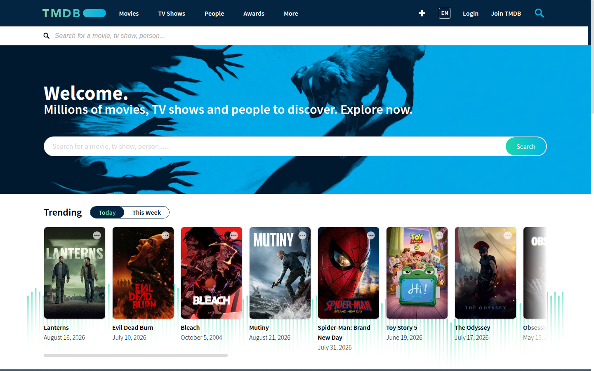

2. 注册页：[https://www.themoviedb.org/signup](https://www.themoviedb.org/signup)。填写 Username / Password / Email，或使用 Google。验证邮箱。

   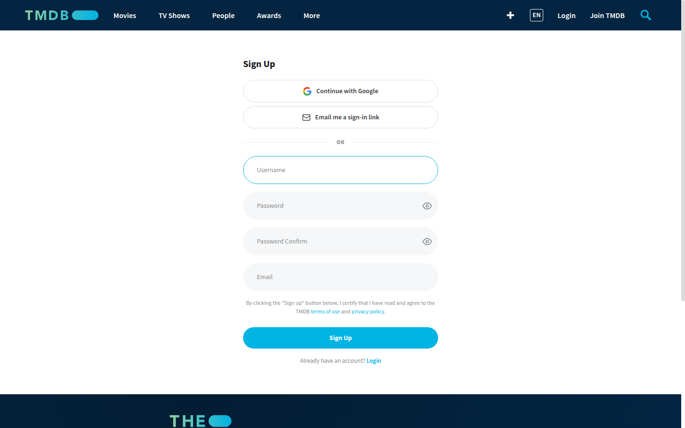

### 申请 Key

文档：[https://developer.themoviedb.org/docs/getting-started](https://developer.themoviedb.org/docs/getting-started) — 登录后在账号设置中打开 **API**。

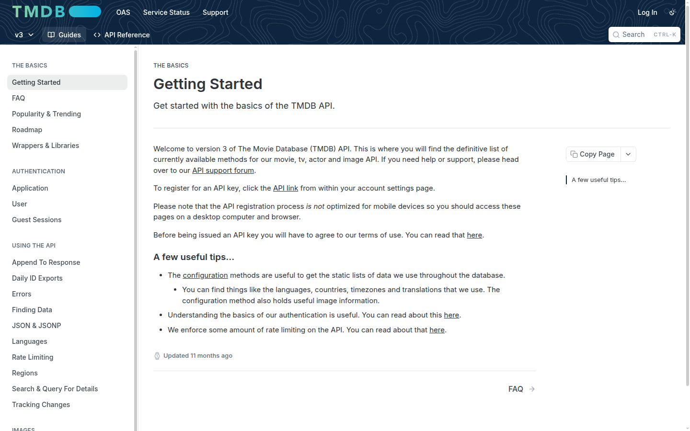

设置页：[https://www.themoviedb.org/settings/api](https://www.themoviedb.org/settings/api)

未登录会落到权限页。登录后再次打开同一 URL。

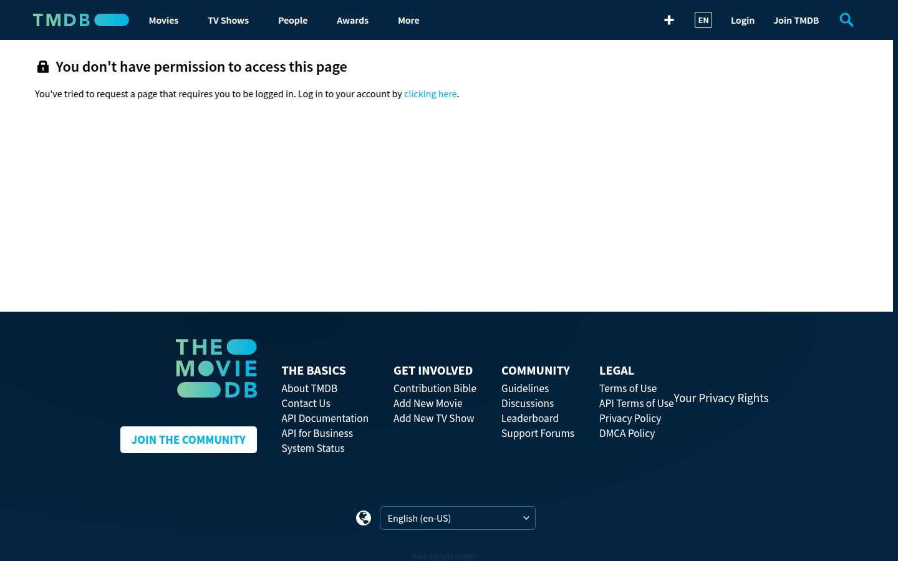

登录后选择 **Developer**，填写应用名称（例如 `Subtitle Scout`），提交后立即生效。复制 **API Key (v3 auth)** 或 v4 Read Access Token。

### 写入 Scout

向导第二步 **TMDB**：粘贴 → **测试** → 保存。之后可在 Settings 的 TMDB 卡片修改。

---

## 2. ASSRT Token

ASSRT（[assrt.net](https://assrt.net)，SHOOTER / 伪射手）是专业中文字幕站，供找字幕流水线直接装中文成品。向导允许跳过；中文片库不应跳过。

实测配额为 **每分钟 5 次**。Scout 将请求间隔限制在约 15 秒。

### URLs

```
https://assrt.net/
https://assrt.net/user/register.xml
https://assrt.net/usercp.php
https://assrt.net/api/doc
```

### 注册

首页不提供注册入口。打开 [https://assrt.net/user/register.xml](https://assrt.net/user/register.xml)，或从内页选择 **加入我们**。

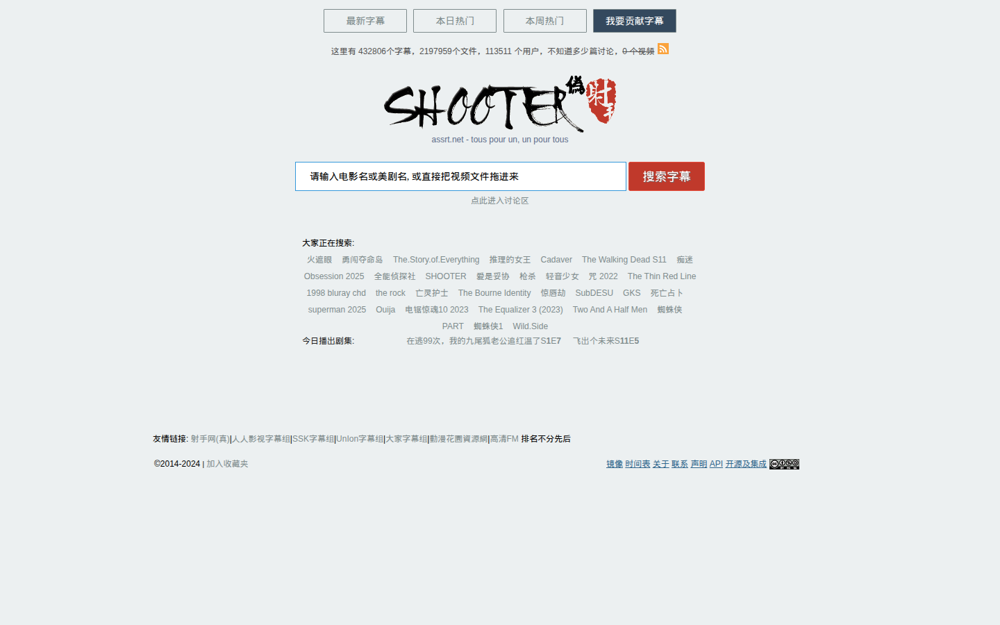

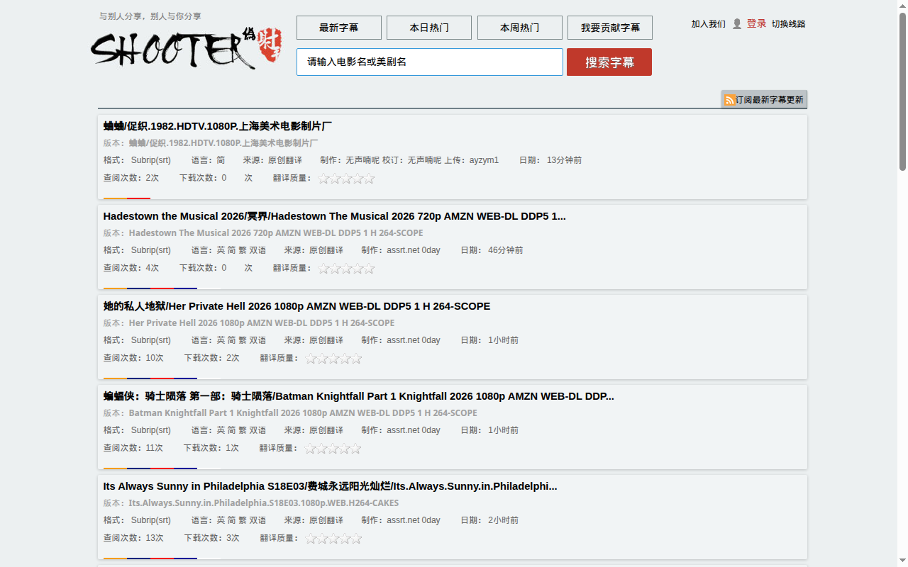

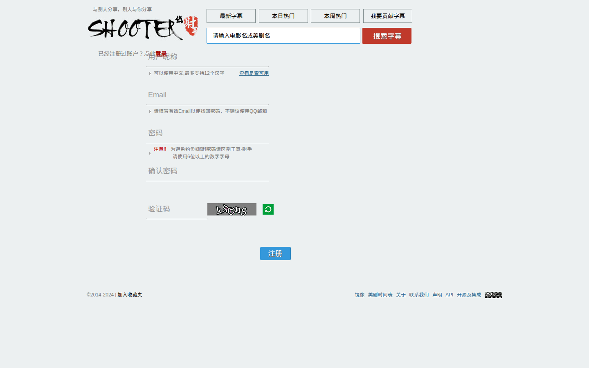

注册页写明不建议使用 QQ 邮箱。

### 取得 Token

登录后点击导航 **用户面板**（或头像），进入：

```
https://assrt.net/usercp.php
```

Token 显示在该页，为 32 位字母数字，可重置。

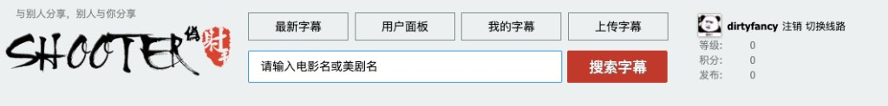

说明见 [https://assrt.net/api/doc](https://assrt.net/api/doc#usetoken)。

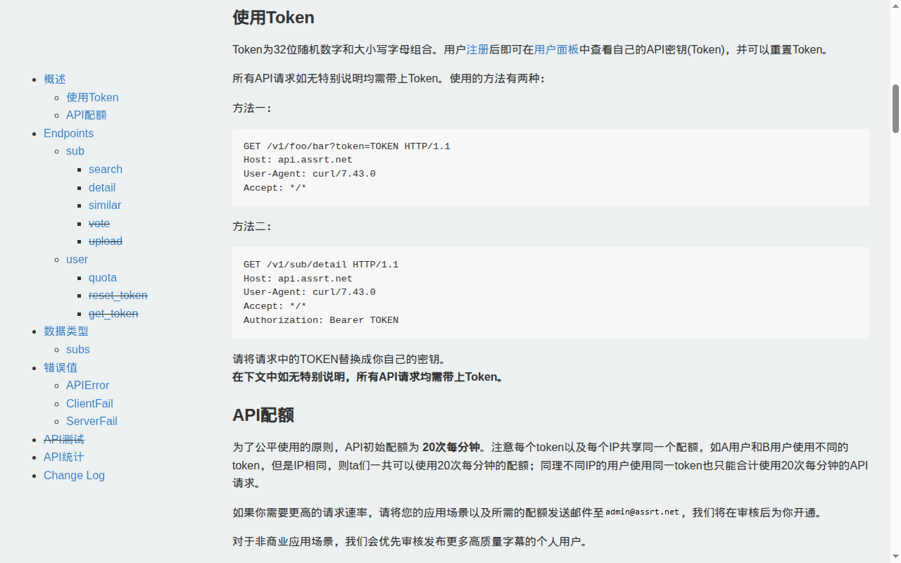

### 写入 Scout

向导 **字幕源** 或 Settings 的 ASSRT 卡片：粘贴 → **测试**。仅测试通过的值会保存。

---

## 3. OpenSubtitles API

OpenSubtitles 是面向**中文用户和海外用户**的国际字幕源：专业中文站覆盖不到的片目可以在这里找到，非中文用户也把它当作常用源。向导标为可跳过，**仍应配置**——不要省的原因是它对两类用户都有用。翻译 agent 也可以把它当作外文源字幕使用。生成 API key **不需要 VIP**。

使用 [opensubtitles.com](https://www.opensubtitles.com/)，不是已停维护的 opensubtitles.org。

### URLs

```
https://www.opensubtitles.com/
https://www.opensubtitles.com/en/consumers
https://opensubtitles.stoplight.io/docs/opensubtitles-api/
```

### 注册

打开 [https://www.opensubtitles.com/](https://www.opensubtitles.com/)，右上角 **Register**。

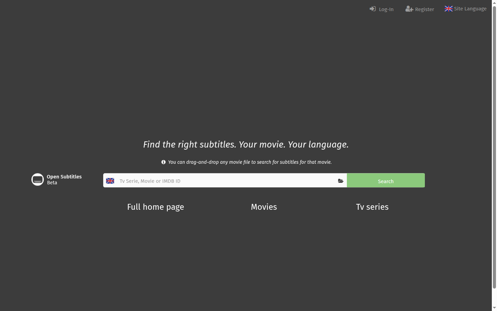

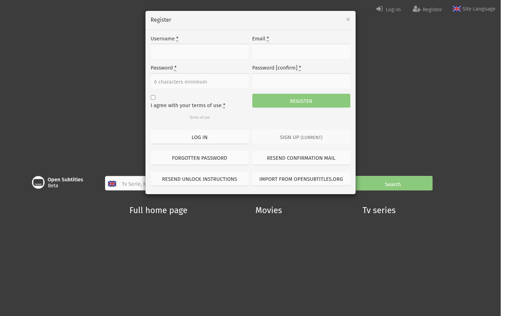

用户名与密码可随后填入 Scout 以提高下载档位；API key 不依赖这两项。

### 创建 Consumer

登录后打开：

```
https://www.opensubtitles.com/en/consumers
```

未登录会跳到登录页。登录后再次打开同一 URL。

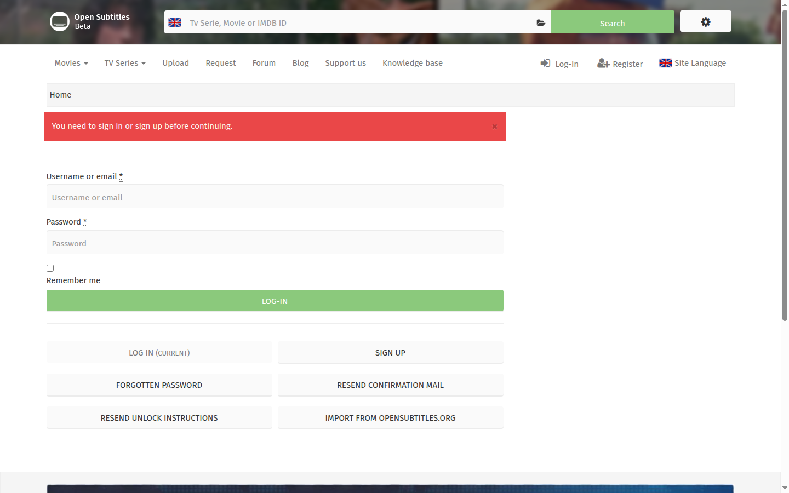

侧栏选择 **API consumers**。点击 **NEW CONSUMER**。应用名仅允许字母与数字（例如 `subtitlescout`，不要空格或连字符）。创建后列表出现该 consumer；齿轮图标用于查看并复制 API key。

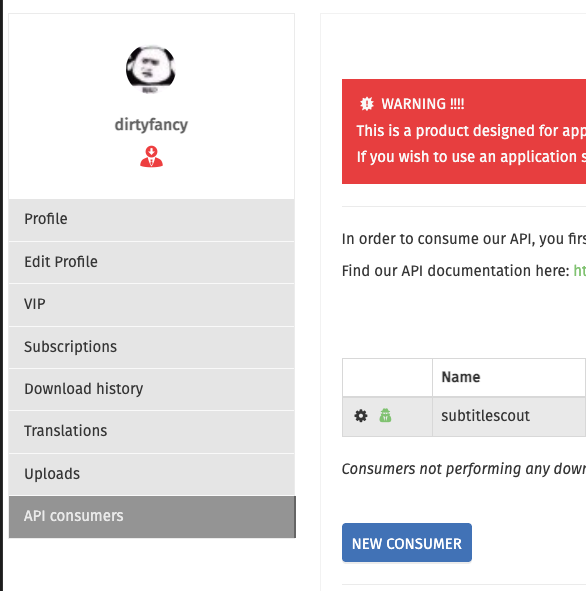

### 写入 Scout

Settings / 向导字幕源 · OpenSubtitles：

- **API key** — 启用该源所必需
- **用户名 / 密码** — 可选，用于登录档下载额度

仅测试通过的值会保存。

---

## 4. Jimaku API Key

Jimaku **不是**专业中文源。它向翻译 agent 提供日文源字幕（动画等）。向导可跳过；翻译日语原作时应当配置。与 OpenSubtitles「中外用户都常用」不是同一条理由。

### URLs

```
https://jimaku.cc/
https://jimaku.cc/login
https://jimaku.cc/account
https://jimaku.cc/api/docs
```

右上角 **Login**。注册后在 [https://jimaku.cc/account](https://jimaku.cc/account) 生成 key。文档：[https://jimaku.cc/api/docs](https://jimaku.cc/api/docs)。

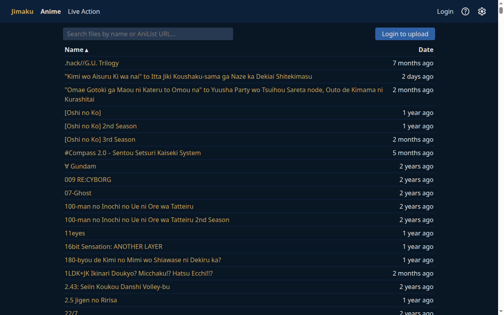

写入向导字幕源或 Settings 的 Jimaku 卡片。

---

## 5. r3sub 账号（邮箱 + 密码）

r3sub.com 收录台版官方繁体中文字幕轨（iTunes / 蓝光提取）。仅对中文目标用户展示——其他目标语言的向导和设置页会隐藏它。

### URLs

```
https://r3sub.com/
https://forum.r3sub.com/entry/register
```

### 注册

1. 用邮箱在论坛注册
2. **完成邮箱验证**——未验证的账号无法登录
3. 回到 Scout 填入**同一套邮箱和密码**

### 写入 Scout

Settings / 向导字幕源 · r3sub：邮箱 + 密码（两项都必填）。测试按钮做真实登录，只有测通的账密才落库。

注意：站上部分资源只有蓝光位图字幕（`.sup`）——Scout 只处理文本字幕，会如实跳过这类资源。

---

## 6. SubDL API key

SubDL 是 Subscene（2024 年关站）事实上的接班者——国际化片库，英语与欧洲语言最强。所有目标语言都用得上；对中文用户主要充当翻译 agent 的英文底稿来源。

### URLs

```
https://subdl.com/
https://subdl.com/panel/api
```

### 注册

1. 注册**免费**账号（需邮箱验证）
2. 在账号面板复制 API key（[https://subdl.com/panel/api](https://subdl.com/panel/api)）

免费 key 即可用：搜索配额 2000/天，下载走匿名池每 IP 300/天。付费 "Pro" 档只在多 IP 服务器集成（账号级下载池）时才有意义。

### 写入 Scout

Settings / 向导字幕源 · SubDL：单个 API key 字段。只有测通的 key 才落库。

---

## 安全

- 不要将密钥提交到 git、issue、截图或聊天
- `.env` 不是这些键的存放处
- 泄露后在对应站点重置：ASSRT [usercp](https://assrt.net/usercp.php)、TMDB [API](https://www.themoviedb.org/settings/api)、OpenSubtitles [consumers](https://www.opensubtitles.com/en/consumers)、Jimaku [account](https://jimaku.cc/account)、SubDL [panel](https://subdl.com/panel/api)；r3sub 在论坛改账号密码
